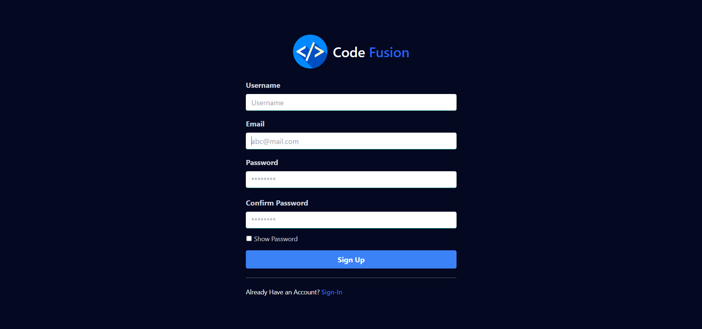
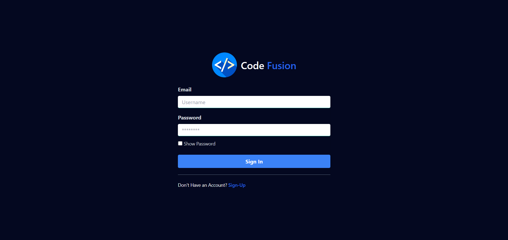
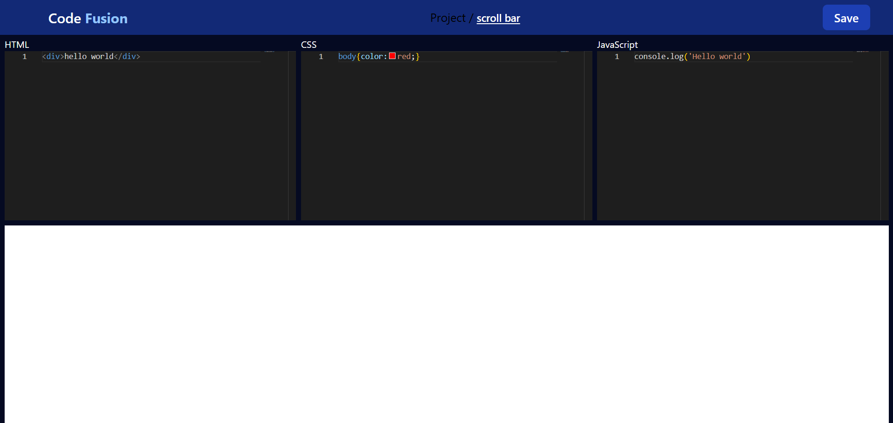

# <h1>Code Fusion</h1>

A full-stack project for managing coding projects, featuring user authentication, project CRUD operations, and a rich user interface.

# Backend (Server)

User Authentication: Secure user login with JWT.
Project Management: APIs for adding, reading, updating, and deleting projects.
Database: MongoDB for storing user data and project information.

# Frontend (Client)

Interactive UI: Built with React and styled using a modern UI library.
Form Handling: Managed with react-hook-form for easy validation.
Context API: Centralized state management for user data and project information.

# Technologies

Backend
Node.js
Express.js
MongoDB with Mongoose
JWT for Authentication
bcrypt.js for Password Hashing
Frontend
React 18
Axios for API requests
React Router DOM for navigation
React Hot Toast for notifications
React Hook Form for validation
React Icons for UI enhancements
Prerequisites
Node.js (v16+ recommended)
MongoDB (local or cloud instance)
Getting Started

# API Endpoints

Authentication
POST /auth/signup: Register a new user.
POST /auth/login: Login and receive a JWT token.
POST /auth/valid: Validate the JWT token.

Projects
GET /code/read/:userID: Fetch all projects for a user.
POST /code/add: Add a new project.
PUT /code/update/:projectId: Update an existing project.
DELETE /code/delete/:projectId: Delete a project.
Context API Integration
Global State Management: User and project data are stored in a centralized Context.
Efficient Updates: Changes (e.g., adding or deleting projects) reflect instantly across the UI.
Future Improvements
Enhance validation on both frontend and backend.
Add a rich text/code editor for project management.
Implement a dark/light mode toggle.

# Project Images

Sign-up Page UI

Login Page UI

Code Screen Page UI

Adding the project UI

Deleting the Project Project UI

